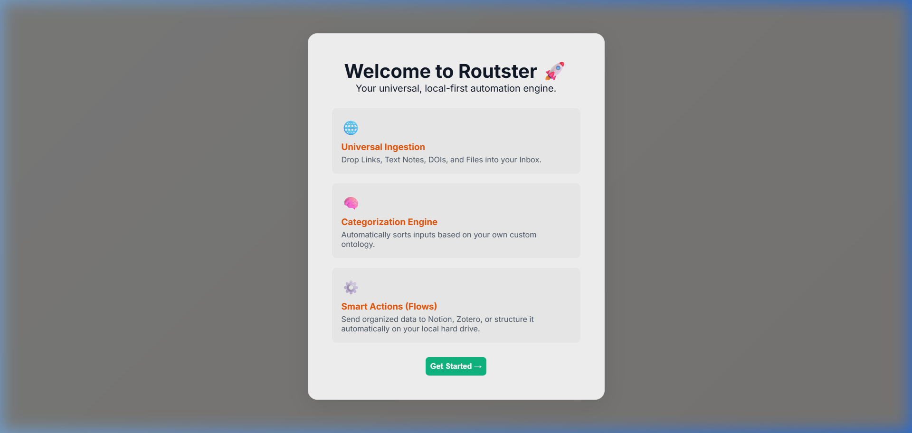

# 🚀 Routster

**Universal, local-first automation engine for knowledge management.**

Routster automatically classifies, routes, and exports files, links, and text snippets to any service — Notion, Zotero, Google Drive, Obsidian, and more. It runs entirely on your machine with zero cloud dependencies.

---

## ✨ Features

| Feature | Description |
|---------|-------------|
| 🧠 **NLP Classifier** | Multi-tier classification: file type → filename hints → TF-IDF semantic scoring → adaptive learning |
| 📥 **Universal Inbox** | Paste URLs, DOIs, drag-and-drop files, or pull from Chrome bookmarks |
| ⚡ **Flow Builder** | Visual rules: "When category = X → send to Y, Z, W" with ordered action chains |
| 🔌 **12+ Connectors** | Zotero, Notion, Obsidian, Instapaper, Pocket, Raindrop, Readwise, Webhook, Local Disk, Google Drive, Custom API, Open API & Macros |
| 🧩 **Custom Connectors** | Build your own REST API connector with URL, headers, and body template variables |
| 🔓 **Open API** | Inbound webhook for iOS Shortcuts, Python scripts, browser extensions, IFTTT, etc. |
| 🎨 **Dual Themes** | Beige/Orange light mode and Forest Green dark mode |
| 🌍 **16 Languages** | English, Spanish, Portuguese, French, German, Chinese, Japanese, Korean, Russian, Arabic, Hindi, Italian, Dutch, Polish, Turkish, Vietnamese |
| ⚙️ **Settings Panel** | Full GUI configuration — classifier thresholds, API secrets, database management, and more |
| 📦 **Standalone EXE** | One-click installer for Windows. No terminal, no Docker, no dependencies. |

---

## 📸 Screenshots

<p align="center">
  
</p>

<p align="center"><em>The onboarding wizard. Routster ships in a Beige/Orange light theme and a Forest Green dark theme.</em></p>

---

## 🛠️ Installation

### Option 1: Download the Installer (Recommended)

1. Go to [Releases](https://github.com/outdatedcaveman/routster/releases)
2. Download `Routster-Setup-1.2.0.exe`
3. Run the installer — it's ready to use immediately

### Option 2: Run from Source

```bash
# Clone the repository
git clone https://github.com/outdatedcaveman/routster.git
cd routster

# Install dependencies
npm install

# Build the frontend
npm run build:frontend

# Launch the app
npm start
```

### Option 3: Build Your Own EXE

```bash
npm run build:exe
```

The installer will appear in `dist-app/`.

---

## 🚀 Quick Start

1. **Launch Routster** — the onboarding wizard guides you through setup
2. **Define Categories** — e.g. "Research Papers", "Podcasts", "Work Invoices"
3. **Configure Connectors** — set up Zotero, Notion, Google Drive, or any custom API
4. **Build Flows** — assign actions to each category ("When Research Paper → Zotero + Google Drive")
5. **Ingest Content** — paste URLs, drop files, or send data via the webhook API
6. **Watch it work** — Routster classifies and routes everything automatically

---

## 🔌 Connector Reference

| Connector | Type | Description |
|-----------|------|-------------|
| Zotero | Export | Academic reference manager |
| Instapaper | Export | Read-it-later for articles |
| Notion | Export | Save to a Notion database |
| Obsidian | Export | Save as Markdown in your vault |
| Pocket | Export | Mozilla's read-it-later |
| Raindrop.io | Export | Visual bookmark manager |
| Readwise | Export | Highlights & reading tracker |
| Webhook | Export | Send to any URL via HTTP POST |
| Local Disk | Export | Copy/move files to local folders |
| Google Drive | Export | Sync to Drive via Desktop app |
| Custom API | Export | Build your own REST API connector |
| Open API & Macros | System | Configure inbound webhook + macros |

---

## 📡 API Usage

Routster exposes an inbound webhook for programmatic ingestion:

```bash
# Send a URL
curl -X POST http://localhost:4000/api/open/ingest \
  -H "Content-Type: application/json" \
  -d '{"url":"https://arxiv.org/abs/2301.00001","title":"Cool Paper"}'

# Send raw text
curl -X POST http://localhost:4000/api/open/ingest \
  -H "Content-Type: application/json" \
  -d '{"type":"text","textContent":"Meeting notes from today..."}'
```

Set an API secret in **Settings → API & Webhooks** to protect your endpoint.

---

## 🧩 Extending Routster

### Custom Connectors (via GUI)
Use the **Custom API Connector** in the Flows tab to point to any REST endpoint with variable interpolation (`{title}`, `{url}`, `{category}`, `{description}`, `{timestamp}`).

### Plugin Connectors (via Code)
Drop a `.js` file into `connectors/` with this structure:

```javascript
module.exports = {
  id: 'my_plugin',
  name: 'My Plugin',
  icon: '🔌',
  description: 'My custom connector',
  configFields: [
    { key: 'api_key', label: 'API Key', required: true, type: 'password' }
  ],
  test: async (config) => ({ success: true, message: 'OK' }),
  execute: async (entity, config) => {
    // entity has: title, url, category, description, type, filePath
    // Return: { success: true }
  }
};
```

### Trigger Plugins
Drop a `.js` file into `triggers/` with:

```javascript
module.exports = {
  id: 'my_trigger',
  name: 'My Trigger',
  poll: async () => {
    // Return array of items to ingest
    return [{ url: '...', title: '...', type: 'url' }];
  }
};
```

---

## 🏗️ Architecture

```
┌─────────────────────────────────────────────────┐
│                  Electron App                    │
├─────────────┬───────────────────────────────────┤
│  React UI   │      Express Server (port 4000)    │
│  (Vite)     │                                     │
│             │  ┌──────────┐  ┌──────────────┐   │
│  Inbox      │  │ Classifier│→│ Route Engine  │   │
│  FlowBuilder│  │ (NLP)    │  │ (Connectors) │   │
│  Settings   │  └──────────┘  └──────────────┘   │
│             │        ↕                            │
│             │  ┌──────────────┐                  │
│             │  │ SQLite (WAL) │                  │
│             │  └──────────────┘                  │
└─────────────┴───────────────────────────────────┘
```

---

## 🤝 Contributing

1. Fork the repository
2. Create a feature branch (`git checkout -b feature/my-feature`)
3. Commit your changes (`git commit -am 'Add my feature'`)
4. Push to the branch (`git push origin feature/my-feature`)
5. Open a Pull Request

---

## 📜 License

MIT License — see [LICENSE](LICENSE) for details.

---

## 🙏 Acknowledgments

Built with [Electron](https://electronjs.org/), [Express](https://expressjs.com/), [React](https://react.dev/), [Vite](https://vite.dev/), and [better-sqlite3](https://github.com/WiseLibs/better-sqlite3).
